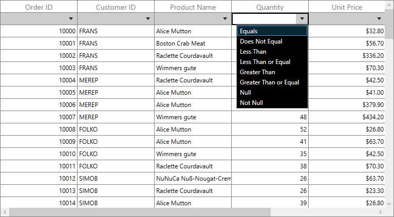

# How to set style for the Filter Row dropdown in WPF DataGrid (SfDataGrid)?

# About the sample

This example illustrates how to set style for the Filter Row dropdown in WPF DataGrid (SfDataGrid).

[WPF DataGrid](https://www.syncfusion.com/wpf-ui-controls/datagrid) (SfDataGrid) doesn’t have direct support to set style for the filter row dropdown. However, you can achieve this by creating custom GridFilterRowCell and RowGenerator.

```C#

public MainWindow()
 {
     InitializeComponent();
     this.dataGrid.RowGenerator = new CustomRowGenerator(this.dataGrid);
 }

public class GridFilterRowCellExt : GridFilterRowCell
{

    public GridFilterRowCellExt()
        : base()
    { }

    /// <summary>
    /// Opens the FilterOptionPopup with the FilterOptionList.
    /// </summary>

    public override void OpenFilterOptionPopup()
    {
        base.OpenFilterOptionPopup();

        var styleListBox = new Style(typeof(ListBox));

        styleListBox.Setters.Add(new Setter
        {
            Property = BackgroundProperty,
            Value = Brushes.Black
        });

        styleListBox.Setters.Add(new Setter
        {
            Property = ForegroundProperty,
            Value = Brushes.White
        });

        this.FilterOptionsList.Style = styleListBox;
        
    }
}

public class CustomRowGenerator : RowGenerator
{
    public CustomRowGenerator(SfDataGrid dataGrid)
        : base(dataGrid)
    {
    }

    /// <summary>
    /// Return the Custom FilterRowCell
    /// </summary>
    /// <typeparam name="T"></typeparam>
    /// <returns>GridCell</returns>

    protected override GridCell GetGridCell<T>()
    {

        //If the Cell is FilterRowCell return custom FilterRowCell

        if (typeof(T) == typeof(GridFilterRowCell))
            return new GridFilterRowCellExt();
        return base.GetGridCell<GridCell>();
    }
}


```




## Requirements to run the demo

Visual Studio 2015 and above versions.
